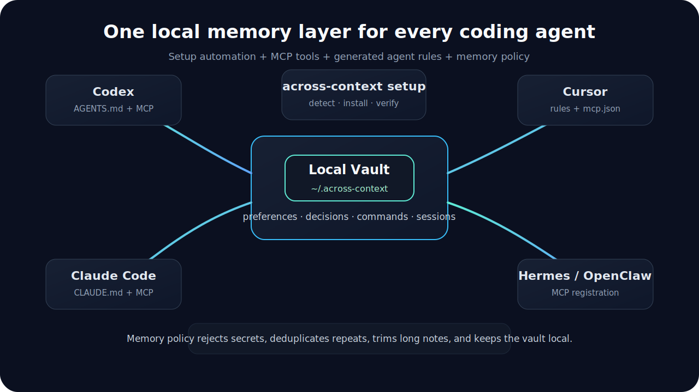

# Across Context


One local-first memory layer for every coding agent.


Across Context is a zero-runtime-dependency CLI and MCP server that gives Codex,
Claude Code, Cursor, Hermes, OpenClaw, and future coding agents one shared local
source of truth. It stores durable preferences, project decisions, reusable
commands, and compact session summaries in a local vault, then teaches agents
when to read and write that memory.

## English

### Why It Exists

Modern coding agents are powerful, but their memory is fragmented. A useful
preference learned by one agent often stays trapped in one chat, one IDE, or one
tool-specific history. Across Context makes that memory portable across agents
without sending it to a hosted service.

Use it when you want agents to remember:

- how you like work to be done
- how a repository is built, tested, and released
- which project decisions were already made
- which commands are safe and repeatable
- what the last agent learned during a complex task

### What It Does

- Creates a local vault at `~/.across/data/across-context`
- Runs a stdio MCP server with memory tools
- Detects supported local agents
- Registers MCP integrations where each agent supports it
- Generates `AGENTS.md`, `CLAUDE.md`, and Cursor rules
- Adds behavior rules so agents know when to read and write memory
- Protects the vault with a memory policy engine
- Provides a local dashboard, explainable hybrid search, pending approval, lifecycle controls, MCP resources and prompts, team export, and deterministic hooks

### How It Works



Across Context has three layers:

1. **MCP tools, resources, and prompts** give agents the ability to search, write, inspect, and reuse memory workflows.
2. **Generated rules** teach agents when to use those capabilities.
3. **Memory policy** rejects unsafe or low-value writes before they reach disk.

This is the important product idea: MCP alone is not enough. Agents also need
operating instructions, and automatic memory needs guardrails.

### New in v0.3

- MCP resources and prompts for discoverable memory context and repeatable agent workflows
- Explainable hybrid search: `across-context search "agent handoff" --mode hybrid --json --explain`
- Dashboard review actions for approving, archiving, expiring, forgetting, searching, and filtering memories
- Batch lifecycle updates: `across-context update-status active <memory-id...>`
- A2A-ready Agent Card metadata: `across-context agent-card --json`
- Team-safe project export: `across-context team export --project .`
- Deterministic hooks: `hook task-start` and `hook task-end`

### Install

This first open-source release is GitHub-first. The npm package metadata is
ready, but the package does not need runtime dependencies.

Install from source:

```bash
git clone https://github.com/fantasyce/across-context.git
cd across-context
npm link
```

Or install from a local release tarball:

```bash
npm pack
npm install -g ./across-context-0.4.1.tgz
```

Verify:

```bash
across-context --help
```

For host apps such as Across Agents Assistant, install a local plugin runtime
under the user's hidden plugin directory:

```bash
across-context install host-plugin
```

This copies the Across Context runtime to `~/.across/plugins/across-context`,
creates `~/.across/bin/across-context`, and writes the plugin manifest at
`~/.across/plugins/across-context/manifest.json`. Host apps should discover that
wrapper instead of pointing at a source checkout, `npm link`, or a path under
`~/Documents`.

### Quick Start

Run this from any project directory:

```bash
across-context setup --all --yes
```

That one command initializes the vault, detects local agents, registers MCP
where possible, and writes project instruction files.

If you only want project files and do not want to change user-level agent
configuration:

```bash
across-context setup --all --yes --no-external
```

Verify the result:

```bash
across-context doctor
across-context status
```

### Agent Support

| Agent | What setup does |
| --- | --- |
| Codex | Writes `AGENTS.md` and registers `across-context mcp` when available. |
| Claude Code | Writes `CLAUDE.md` and registers a user-level MCP server when available. |
| Cursor | Writes `.cursor/mcp.json` and `.cursor/rules/across-context.mdc`. |
| Hermes | Registers `across-context mcp` when available. |
| OpenClaw | Writes the OpenClaw MCP configuration when available. |

### Automatic Memory Behavior

Generated agent rules instruct agents to:

- search relevant memory at task start
- use project context before architecture, release, dependency, test, or documentation decisions
- remember only durable context before final responses
- keep low-confidence automatic notes in pending review
- avoid duplicate memories
- never write secrets, credentials, huge logs, full chat history, temporary errors, private screenshots, or one-off noise

### Dashboard

Start the local review dashboard:

```bash
across-context dashboard
```


The dashboard runs on `127.0.0.1` by default and shows memory counts, pending
review items, lifecycle status, visibility, stored text, search explanations,
and local lifecycle actions.

### Memory Policy

All CLI and MCP writes go through the same policy engine.

Allowed memory types:

- `preference` - stable user preferences
- `decision` - durable project or architecture decisions
- `command` - reusable build, test, release, or troubleshooting commands
- `session` - compact handoff summaries
- `note` - short durable context that does not fit the other categories

Controlled writes:

- secret-like content is rejected
- duplicate memories return the existing record instead of appending another line
- long memories are trimmed to a safe default length
- low-confidence automatic notes and session summaries are stored as `pending`
- approved memories become `active`; stale memories can be `archived` or `expired`
- `compact` removes duplicates already on disk
- `forget <id>` removes a memory by id

### CLI Reference

```bash
across-context init
across-context setup --all --yes
across-context doctor
across-context status
across-context remember "Prefer small commits with tests." --type preference
across-context remember "Run npm test before final answers." --scope project --project . --type command
across-context search "tests before final" --project .
across-context search "agent handoff context" --mode semantic --project .
across-context search "release verification" --mode hybrid --json --explain
across-context list
across-context pending
across-context approve <memory-id>
across-context archive <memory-id>
across-context expire <memory-id>
across-context update-status active <memory-id...>
across-context stats
across-context compact
across-context forget <memory-id>
across-context dashboard
across-context agent-card --json
across-context team export --project .
across-context hook task-start --query "release workflow" --project .
across-context hook task-end --summary "Implemented dashboard and semantic search." --project .
across-context install host-plugin
across-context mcp
```

### MCP Server

The MCP server exposes tools:

- `remember_context`
- `search_context`
- `review_pending_memories`
- `approve_memory`
- `get_project_context`
- `get_agent_card`
- `export_agent_instructions`

It also exposes resources:

- `across-context://agent-card`
- `across-context://stats`
- `across-context://memories`
- `across-context://project-context`

And prompts:

- `task-start-context`
- `task-end-summary`
- `memory-review`

Start it manually:

```bash
across-context mcp
```

### Vault Layout

```text
~/.across/data/across-context/
  global/
    memories.jsonl
  projects/
    <project-id>/
      profile.json
      memories.jsonl
```

For isolated tests:

```bash
ACROSS_CONTEXT_HOME=/tmp/across-context-demo across-context init
```

### Privacy

- The vault is local-first.
- This package does not sync memory to a hosted service.
- Public exports never include absolute project paths.
- Generated files should be reviewed before committing.
- Secrets, tokens, credentials, cookies, private screenshots, and large logs should not be stored.

### Development

```bash
npm test
bash scripts/check.sh
npm pack --dry-run
```

### Community and Feedback

- Bug reports: [GitHub Issues](https://github.com/fantasyce/across-context/issues/new/choose)
- Product ideas: [Discussions Ideas](https://github.com/fantasyce/across-context/discussions/categories/ideas)
- Setup questions: [Discussions Q&A](https://github.com/fantasyce/across-context/discussions/categories/q-a)
## 中文

### 这个项目是什么

Across Context 是一个本地优先的跨 Agent 共享记忆层。它让 Codex、Claude
Code、Cursor、Hermes、OpenClaw 以及未来更多 coding agent 使用同一个本地记忆库。

它不是单纯的 MCP Server。完整产品由三部分组成：

1. **MCP 工具**：让 Agent 有能力读取和写入记忆。
2. **自动生成的 Agent 规则**：告诉 Agent 什么时候应该读、什么时候应该写。
3. **记忆治理策略**：防止 Agent 乱写、重复写、写入密钥或写爆本地 vault。

### 为什么需要它

现在每个 Agent 都有自己的上下文和聊天历史。你在 Claude Code 里沉淀的偏好，
Codex 不知道；Cursor 里学到的项目命令，Hermes 也不一定知道。Across Context
把这些稳定、可复用的上下文放到一个本地 vault 里，让不同 Agent 都能读到。

适合保存：

- 你的长期偏好
- 项目的构建、测试、发版方式
- 已经做过的架构决策
- 可以复用的命令
- 一次复杂任务结束后的简短交接摘要

### 一键开始

在任意项目目录下执行：

```bash
across-context setup --all --yes
```

它会自动完成：

- 初始化 `~/.across/data/across-context`
- 检测本机已安装的 Agent
- 注册 MCP 服务
- 生成 `AGENTS.md`
- 生成 `CLAUDE.md`
- 生成 Cursor MCP 配置和规则
- 注入自动读写记忆的行为规则

### v0.3 新能力

- MCP resources 和 prompts：让 Agent 可发现地读取上下文并复用标准记忆工作流
- 可解释混合搜索：`across-context search "agent handoff" --mode hybrid --json --explain`
- Dashboard 审查操作：搜索、过滤、审批、归档、过期和删除记忆
- 批量生命周期更新：`across-context update-status active <memory-id...>`
- A2A-ready Agent Card 元数据：`across-context agent-card --json`
- 团队安全导出：`across-context team export --project .`
- 确定性 hooks：`hook task-start` 和 `hook task-end`

如果你只想生成项目规则，不想修改用户级 Agent 配置：

```bash
across-context setup --all --yes --no-external
```

验证安装：

```bash
across-context doctor
across-context status
```

如果要把 Across Context 作为 Across Agents Assistant 这类宿主应用的插件
使用，请安装到用户隐藏插件目录：

```bash
across-context install host-plugin
```

这个命令会复制运行时到 `~/.across/plugins/across-context`，创建
`~/.across/bin/across-context`，并写入
`~/.across/plugins/across-context/manifest.json`。宿主应用应该发现这个
wrapper，而不是指向源码目录、`npm link` 或 `~/Documents` 下的路径。

### 支持的 Agent

| Agent | setup 会做什么 |
| --- | --- |
| Codex | 生成 `AGENTS.md`，并在可用时注册 MCP。 |
| Claude Code | 生成 `CLAUDE.md`，并在可用时注册用户级 MCP。 |
| Cursor | 生成 `.cursor/mcp.json` 和 `.cursor/rules/across-context.mdc`。 |
| Hermes | 在可用时注册 `across-context mcp`。 |
| OpenClaw | 在可用时写入 OpenClaw MCP 配置。 |

### 自动读写记忆

生成的 Agent 规则会要求 Agent：

- 任务开始时先搜索相关记忆
- 做架构、依赖、测试、文档、发版决策前读取项目上下文
- 最终回复前只写入稳定、可复用的记忆
- 低置信度自动记忆先进入 pending review
- 避免重复写入
- 不写密钥、token、cookie、大段日志、完整聊天记录、临时错误、私密截图或一次性噪音

### 本地 Dashboard

启动本地审查面板：

```bash
across-context dashboard
```


它默认运行在 `127.0.0.1`，可以查看记忆数量、待审批项、生命周期状态、可见性、记忆内容、搜索解释，并执行本地生命周期操作。

### 记忆治理

所有 CLI 和 MCP 写入都会先经过同一个策略引擎。

支持的记忆类型：

- `preference`：长期用户偏好
- `decision`：项目或架构决策
- `command`：可复用命令
- `session`：简短任务交接摘要
- `note`：其他短小稳定上下文

治理规则：

- 疑似密钥会被拒写
- 重复记忆不会再次追加
- 过长记忆会被裁剪
- 低置信度自动 note/session 会进入 `pending`
- 审批后的记忆会变成 `active`，旧记忆可以归档或过期
- `compact` 可以清理历史重复记录
- `forget <id>` 可以删除指定记忆

### 常用命令

```bash
across-context init
across-context setup --all --yes
across-context doctor
across-context status
across-context remember "Prefer small commits with tests." --type preference
across-context remember "Run npm test before final answers." --scope project --project . --type command
across-context search "tests before final" --project .
across-context search "agent handoff context" --mode semantic --project .
across-context search "release verification" --mode hybrid --json --explain
across-context list
across-context pending
across-context approve <memory-id>
across-context archive <memory-id>
across-context expire <memory-id>
across-context update-status active <memory-id...>
across-context stats
across-context compact
across-context forget <memory-id>
across-context dashboard
across-context agent-card --json
across-context team export --project .
across-context hook task-start --query "release workflow" --project .
across-context hook task-end --summary "Implemented dashboard and semantic search." --project .
across-context mcp
```

### MCP Server

MCP Server 暴露工具：

- `remember_context`
- `search_context`
- `review_pending_memories`
- `approve_memory`
- `get_project_context`
- `get_agent_card`
- `export_agent_instructions`

同时暴露 resources：

- `across-context://agent-card`
- `across-context://stats`
- `across-context://memories`
- `across-context://project-context`

以及 prompts：

- `task-start-context`
- `task-end-summary`
- `memory-review`

### 隐私模型

- vault 默认只保存在本机。
- 本包不会把记忆同步到云端服务。
- 公共导出不会包含绝对项目路径。
- 提交生成文件前应该先检查内容。
- 不应该保存密钥、token、凭据、cookie、私密截图或大段日志。

### 开发

```bash
npm test
bash scripts/check.sh
npm pack --dry-run
```

### 社区与反馈

- 问题反馈：[GitHub Issues](https://github.com/fantasyce/across-context/issues/new/choose)
- 产品想法：[Discussions Ideas](https://github.com/fantasyce/across-context/discussions/categories/ideas)
- 使用问题：[Discussions Q&A](https://github.com/fantasyce/across-context/discussions/categories/q-a)
